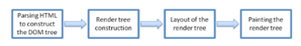
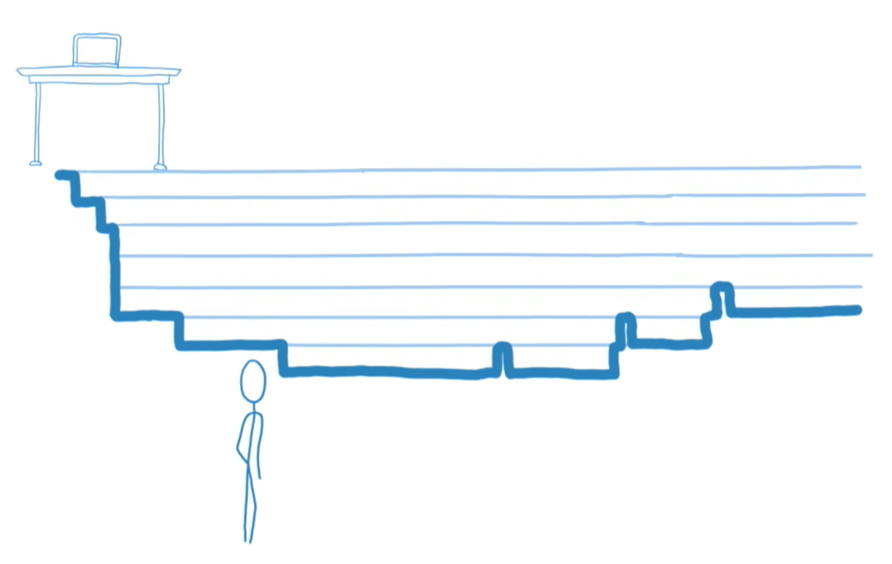
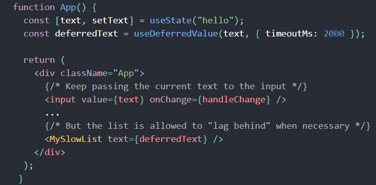

# Mục lục

0. Ôn lại hoạt động của browser (rendering engine)
1. Stack reconciler (for react version < 16.1)
2. Fiber reconciliation (for react version > 16.0)
3. Scheduler
4. Concurrent Mode (Install package)
5. Chia Component cơ bản, Các thư viện hỗ trợ quản lý state tốt, hai ví dụ trong cải thiện perfomace theo cơ chế diffing children

# Hoạt động của browser

## Giai đoạn parsing

Tạo những Javascript object. Kế thừa node class.
Sau khi contruct DOM tree xong, tiếp tục đọc tất cả CSS từ external ,embedded, inline contruct CSSOM.
Đơn vị cơ bản nhất trên cây: underlying DOM tag elements.

## Giai đoạn tạo render tree

Chỉ chứa những element được view trên màn hình.

## Giai đoạn layout và panting

Layout: Tạo layout cho mỗi node trên render tree
Chứa kích thước của mỗi node trong đơn vị pixel và vị trí nó sẽ được print lên màn hình.
Quá trình này gọi là reflow.
Ngoài ra diễn ra reflow khi ta thực hiện các action sau:

- Scroll
- Resize window
- Manipulate DOM elemnts

Painting:
Từng node giao tiếp với giao diện hệ điều hành thông qua UI Backend.
=> Quá trình này gọi là repaint.

## Xét ví dụ update trên Dom

DOM API: mỗi lần có MỘT cập nhật trên DOM thật, browser chạy lại 4 quá trình trên.

### Ví dụ 1:

document.getElementById(‘textInput’).innerHTML = "New Value 1“
document.getElementById(‘textInput’).innerHTML = "New Value 2 "
document.getElementById(‘textInput’).innerHTML = "New Value 3"
Duyệt cây DOM từ trên rootNode để tìm vị trí element có id như trên.

Tiếp tục gọi dom api thực hiện việc update.

=>Manipulate liên tục trên cây DOM, không kiểm soát được số lần update cho trong khoảng thời gian mong muốn=> ảnh hưởng FPS

### Ví dụ 2: Một button, state là isSubmitted. Các element khác phụ thuộc state này. Theo flowchart, state này cần được chú ý cả app

=> Do ta cần lifecycle cho mỗi DOM element, tốn nhiều effort để quản lý chỉ vùng UI (một form submit và một button)

# Stack reconciler

## Tổng quan Reactjs

Là thư viện: render() return react elements, dựa vào những objects này, thông qua dom api, update trên dom thật
Chạy một ứng dụng react là chạy nhiều hàm viết bằng js, quá trình này thông qua dom api cập nhật trên dom thật.
Tổ chức code ui theo component, có hai loại element:

- DOM element
- Component element
  Gọi chung là react element
  => Cách tổ chức này giúp vùng quản lý state, lifecycle riêng cho từng component.

## Minh họa quá trình render ở hai thuật toán

Stack reconciler: Quá trình cập nhật phải hoàn thành hoàn toàn trước khi trở về main thread.

Fiber reconciliation: Quá trình cập nhật được chia thành những unit of work và react quản lý main thread.

## Stack reconciler

Javascript runtime

Gọi render() để duyệt cây đệ quy, mục đích muốn biết elements (underlying dom tag elements) nào tạo nên mỗi component.
Quá trình duyệt này như call một dãy liên tiếp function. Từng function execution context được push vào vùng nhớ stack.
Mỗi khi có updates , updates được push vào queue, js check nếu execution stack đang empty thì nó pop từ queue đẩy vào stack để thực thi.

## Đặc điểm Stack reconciler

Một khi bắt đầu rendering, chúng ta không thể dừng lại cho đến khi việc render cây được hoàn thành.
Vitrual dom gồm những objects immutable, không thể update mà chỉ tạo mới cho các lần sau.
Trong UI, không nhất thiết cứ mỗi lần có update là được apply ngay lập tức.
Mỗi loại update có ưu tiên khác nhau.
Hầu hết các thiết bị ngày này refresh màn hình với 60 FPS, tức là mỗi new frame được display mỗi 16ms. Nếu quá trình react render something trên màn hình tốn nhiều 16ms thì browser xóa frame này.

Ví dụ: Nếu cây element quá to, main thread có thể bị block. Quá trình render đang diễn ra nhưng muốn handle text input được user nhập, phải đợi quá trình render diễn ra xong.

# Fiber reconciliation

## Cây fiber là gì? (Có từ react version > 16.0)

Gồm nhiều node, mỗi node (mutable data) đại diện cho:

- Một React element
- Unit of work
  Mỗi node có props chứa reference đến các child node(child), node cùng cấp(sibling) , parent node(parent) ….
  Fiber tree là ctdl với mỗi node là mutable data

Quá trình render, react perform từng unit of work (Gồm nhiều function). Run diff algorithm trong performUnitOfWork function.

## Cách thức React render, tương tác với dom thực. Cơ chế diff nó ra sao? Tại sao sinh ra virtual dom

Cơ chế chính của react là tracking sự thay đổi của state trên một component và đưa state đã cập nhật ra màn hình.
=> Gọi quá trình này là reconciliation.

Quá trình reconciliation tổng quát: mục tiêu pass react elment( những element cấu thành nên tree ) vào container.

### Giải thích phase render

- Scheduler: Dựa theo pendingWorkPriority chọn unit of work để perform, đưa work này vào update queue.
- Bắt đầu perform một unit work:

* Run thuật toán diffing (Chỉ Subtree nơi có cập nhật diễn ra) giữa node trong currentTree và child trong react element. Tạo fiber node cho workInProgress tree.
* Cập nhật Dom thật
* Trong quá trình này luôn check main thread có cập nhật gì không, nếu có thì quá trình render này quay lại từ đầu.
* Quay lại pop một work ra khỏi queue và tiếp tục perform.

### Thuật toán diffing

Node cũ và element mới cùng type
-> Clone node cũ này và cập nhật props
Node cũ và element mới khác type và có một element mới xuất hiện.
-> Thêm một node mới
Node cũ và element mới khác type và tồn tại một node cũ khác nữa.
-> Xóa node cũ

### Giải thích phase commit: Thay đổi reference đến cây fiber mới

### Lợi ích của fiber tree

- Assign priority to different types of work (chi tiết slide sau)
- Pause work and come back to it later: Quá trình rendering đang diễn ra nhưng hoàn toàn có thể dừng lại khi có một cập nhật khác đến từ main thread mà có độ ưu tiên cao hơn cập nhật đang diễn ra.
- Abort work if it’s no longer needed: Nếu quá trình rendering làm cho thời gian chuyển tiếp giữa 2 frame lớn hơn 16ms ( 60 fps ) thì có thể xem xét bỏ qua cập nhật này.
- Reuse previously completed work: Mỗi kết quả từ việc thực thi một function trong vùng nhớ stack (javascript runtime) có thể được tái sử dụng cho các function kế tiếp

## Scheduler

Mỗi react component instance có một updater. Nó là trung gian giao tiếp giữa những component và react core.
Updater có trách nhiệm:

- Xác định fiber instance trong cây cho mỗi component.
- Yêu cầu Scheduler về priority level cho fiber ấy.
- Push những cập nhật đến update queue của fiber.
- Ghi lại những update work đã hoàn thành với một thứ tự ưu tiên đã được xác định.

#### Chi tiết nhiệm vụ của Scheduler

#### Độ ưu tiên work:

- No work: Hiện tại không có work chờ được thực thi 0
- SynchronousPriority : Xử lý text input, các side- effect đồng bộ 1
- AnimationPriority: Cập nhật liên quan animation 2
- HighPriority: các tương tác liên quan responsive 3
- LowPriority: Data fetching 4
- OffscreenPriority: 5

#### Quá trình truy xuất độ ưu tiên và perfrom một unit of work đã chọn

# Concurrent Mode

## Giới thiệu

Quá trình rendering được chia nhỏ thành những unit of work. Chia nhỏ nó thành các phần nhỏ hơn để có thể xử lý từng phần một cách độc lập. Hiện tại, react dùng scheduler package để làm điều đó.

Concurrent Mode (Làm quá trình render bị ngắt quãng): requestIdeCallBack sẽ run nếu như main thread nhàn rỗi.

## Các chức năng

### Interruptible Rendering:

Quá trình render diễn ra liên tục khi có update khiến main thread (Chứa thao tác nhập text) bị blocking đợi đến khi quá trình render (Cập nhật danh sách kết quả) được thực thi xong.
Xét ví dụ: Nhập text trên một input search component, phía dưới hiển thị danh sách kết quả tương ứng với text vừa nhập.

#### Cần cập nhật:

- text input
- Danh sách kết quả

#### Hai giải pháp:

- Chỉ update danh sách kết quả khi user ngừng gõ-> Không thấy danh sách được update với text tương ứng.
- Thay vì update liên tục danh sách tương ứng text vừa gõ, chúng ta update theo khoảng thời gian cố định.

=> 2 giải pháp này làm deplay quá trình thay đổi state, chứ về bản chất hoạt động render bên dưới không thay đổi.

=> Concurrent mode giải quyết vấn đề này bằng hoạt động ngắt quãng trong quá trình render.

Có thể hiểu mỗi hoạt động update nằm trên một nhánh riêng và work độc lập. React tạo nhiều nhánh cho mỗi update.
Ví dụ có 3 nhánh a, b, c. Đang thực hiện trên a, nhưng xét thấy nhánh c là loại update cần ưu tiên, nó nhảy qua thực hiện nhánh c xong, merge nhánh này vào master (update hoàn thành), sau đó quay trở lại nhánh a tiếp tục update và merge vào master.

### Intentional Loading Sequences:

Để render một component A cần data hay code từ server trả về. Quá trình render vẫn diễn ra nhưng không cập nhật DOM thật do đó tạm dừng work (component A) đang được render, trong lúc đó chuyển sang thực thi work khác (ví dụ: render Loading component). Sau khi xét thấy “state cần có” đã được trả về, lập tức tiếp tục render A.

### Tóm tắt:

Chia làm 2 loại udate trong react theo chức năng mà concurrent mode hỗ trợ:
CPU-bound updates: Thay đổi trên dom, internal data. Concurrent mode phân biệt ưu tiên update và có thể ngắt rendering đang diễn ra nếu như update vừa đến thuộc loại ưu tiên cao.
IO-bound updates: Cần external data. React chỉ quan tâm view, do đó với một data đang có, nó bắt đầu render, không quan tâm data đã có hay chưa. Quá trình render react phát hiện chưa “đủ” data hay code nên nó chuyển sang render 1 snipper (gọi là component loading hay loading states).

## Kích hoạt cho phép sử dụng concurrent mode

Đầu tiên cài đặt package:
npm install react@experimental react-dom@experimental

Concurrent mode liên quan đến thay đổi cách react làm việc bên dưới do đó không thể apply nó cho subtree. Do đó khi dùng Concurrent mode là apply toàn bộ đến App
Thay thế ReactDOM.render(<App />, rootNode) bởi:
ReactDOM.createRoot(rootNode).render(< App / >): Cho phép apply tất cả các feature gọi Concurrent Mode

##### Hoặc

ReactDOM.createBlockingRoot(rootNode).render(< App / >): cho phép apply một nhóm feature gọi là Blocking Mode

Bảng chi tiết features ở mỗi cách config

Chú ý: Legacy Mode chính là ReactDOM.render(< App / >, rootNode)

## Suspense Apis

### Suspense component cho fetch data từ external

Suspense: Tạm dừng quá trình render cho update A, chạy render cho update B, đợi A đủ “data hay code” bắt đầu render A trở lại.

Ví dụ: fetch data, images, scripts hay bất kì work bất đồng bộ.
Xét ví dụ data fetching: Cần external data từ server

Cách xử lý truyền thống: render B -> fetch data bất đồng bộ -> data về -> update state -> render B.

Với Suspense: fetch data bất đồng bộ -> render B-> loading states (render A hay gọi là fallback)-> data về -> tiếp tục render B

### SuspenseList component: chứa nhiều Suspense component

Mỗi component con trong nó cần fetch data nhưng thứ tự data trả về không dự đoán được.
SuspenseList có những prop giúp kiểm soát thứ tự render những component con.
revealOrder: có 3 giá trị

- forwards: thứ tự hiển thị theo giống thứ tự được khai báo
- backwards: thứ tự hiển thị ngược thứ tự được khai báo
- together: cùng nhau hiển thị khi tất cả đã sẵn sàng.
  tail :
  Mặc định hiển thị tất tất cả fallback trong danh sách
- collapsed: Chỉ hiển thị fallback kế tiếp trong danh sách
- hidden: giấu tất cả fallback

### Transtions: Kết hợp useTransistion hook

Xét ví dụ: một page chứa một button gọi là Next và phía dưới hiển thị thông tin học sinh gọi là compoent A.
Mỗi lần click vào Next button, sử dụng suspense, trong quá trình đợi fetch data học sinh khác được hoàn thành, sẽ hiển thị 1 loading component gọi là component B.
Mỗi lần cick như vậy ta thấy thông tin học sinh trước đó bị mất ngay lập tức, thay vào đó là hiển thị component B. Ta muốn control việc hiển thị loading và có thể bỏ qua nó, để giữ hiển thị thông tin học sinh hiện tại.

const [startTransition, isPending] = useTransition({
timeoutMs: 3000
});

giá trị timeoutMs:3000 muốn nói rằng nếu thời gian cần chờ để chuyển sang thông tin học sinh mới lớn hơn 3s thì hiển thị loading component còn nhỏ hơn 3s thì ta cứ keep hiển thị hiện tại.

Code minh họa: ở lại thông tin hs hiện tại và hiển thị text loading, sau 2s nếu data vẫn chưa về thì hiển thị Snipper

### Deferring a Value: Kết hợp useDeferredValue hook

Xét ví dụ: text input component và MyShowList component

Mong muốn sau khi nhập text thì list kết quả có ngay để cùng hiển thị với text. Hiện tại ta không kiểm soát được khoảng time chênh lệch khi nhập text và hiển thị list tương ứng.
Đánh đổi tính consistent trong hiển thị bằng cách cho list tạm dừng trong 2s trước khi nó cập nhật.

## Lợi ích của Concurrent mode apis:

- Developer: Process giảm đi, dễ detect lỗi. Không xử lý rườm rà các logic nhiều điều kiện, giảm code, trông code ít trừu tượng hơn.
- Imporve performance app: Bắt đầu render trong memory kể cả khi “data cho state từ server” chưa trả về, 2 work này làm việc độp lập.

## React Batches state update: call setState liên tục

Khi call setState(), nghĩa là có update diễn ra, react không thực hiện update state ngay lập tức mà push update này queue đợi
React batch nhiều yêu cầu update state để make rerender hiêu quả.

### Lý do:

React full control đối với event handlers (onClick) và lifecycle methodanh sách nên biết được hành vi change liên tục này là an toàn và đợi event handling này kết thúc rồi mới rerender.

Ngoại trừ call ajax hay setTimeout handler là do không biết khi nào quá trình kết thúc.

# Cải thiện react app performance

## Tổ chức component

Nguyên tắc: “single responsibility principle” mỗi component chỉ làm một nhiệm vụ.
Display một data model đến user thông qua UI. Cả hai đều hướng đến chung một kiến trúc thông tin.

Hướng đến chia thành data(logic layer) và UI(presentational layer).

- Container
- Presentational
  => dễ tái sử dụng component, dễ mở rộng app, chia nhỏ mối quan tâm.

## Quản lý sự thay đổi state

- shouldUpdateComponent() lifecycle hoặc react.pureComponent (class component)
- memo: higher order component(react v.16.6) (function component)
- Convert state (thông thường object js) sang cấu trúc immutable data
- Reselect
- Vài ví dụ cụ thể

### shouldComponentUpdate()

State trong C1 có update, state này ảnh hướng đến C3. Trong C3 có nhiều child và state từ C1 thật sự chỉ ảnh hướng đến C6.
Vậy khi run diff cho react element là C1, react bỏ qua C7, C8 nơi đã được đánh dấu là không cần thiết cho sự so sánh trong thuật toán diffing.

### Sử dụng cấu trúc immutable data

- Sử dụng các toán tử copy giá trị sang vùng nhớ mới: three dot, assign.
- Immutable js: convert những js objects sang các ctdl như list, map mà không thể thay đổi.

Ngoài ra,
Tránh khai báo state không chính xác
Các câu hỏi đặt ra: nó được pass từ parent thông qua props? Thay đổi theo thời gian? Có thể tính toán từ bất kỳ state or props nào?
Đặt state ở đâu?
Xác định component nào render dựa vào state, tìm 1 component chung bao bên ngoài, khi báo state ở đây.

### Reselect kết hợp redux

Tạo bộ nhớ cho các value tính toán từ state: dữ liệu trong store chưa chắc dữ liệu sẽ hiển thị trên UI

State={
infor:{
a:1,
b:2,
c:3
}
}

Infor =State.infor
selectorSum=createSelector(Infor,infor=>a+b+c);
Nếu bước tính toán a+b+c thực tế phức tạp hơn và state là một nested object thì reselect là lựa chọn tuyệt vời. Nó chỉ tính toán lại slectorSum khi tham số trong hàm createSelector là Infor thay đổi.

### Ví dụ về render component theo điều kiện:

Ta thấy rằng chạy diffing giữa những children, ta không thể tái sử dụng instance của node input. Do lúc update, react xét thấy position giữa các node đã có thay đổi. Do đó với các khai báo này, tốn effort trong việc tạo ra 2 node mới là p và input.

#### Giải pháp

Reuse được node Input đã tạo trước đó

### Tại sao nên dùng key cho các data có format là danh sách?

So sánh type giữa các element là đủ để quyết định reuse hay xóa hay tạo mới một node. Nhưng nó chỉ phù hợp với các child mà ở đó vị trí của nó là không đổi và danh sách với nhiều item không có sự xáo trộn về thứ tự.

Giả sử react xử lý update danh sách theo hướng thứ tự không đổi: nó hiểu là việc cập nhật sẽ diễn ra từng item và từng item được update => Tốn effort

#### Giải pháp

Dùng key phân biệt gữa những elemnt ngoài yếu tố phải cùng type

Thứ tự từng item trong danh sách sẽ có thay đổi , khi có them thuộc tính key, khi so sánh ngoài việc 2 item phải cùng type thì key phải giống nhau. Do đó dù thứ tự trong danh sách có thay đổi thì việc thay đổi diễn ra ở item có cập nhật.
